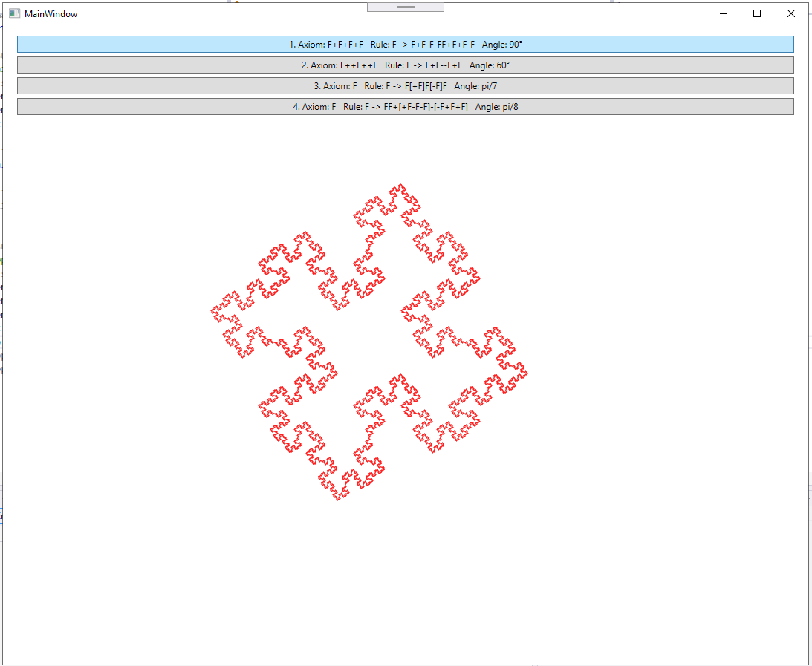
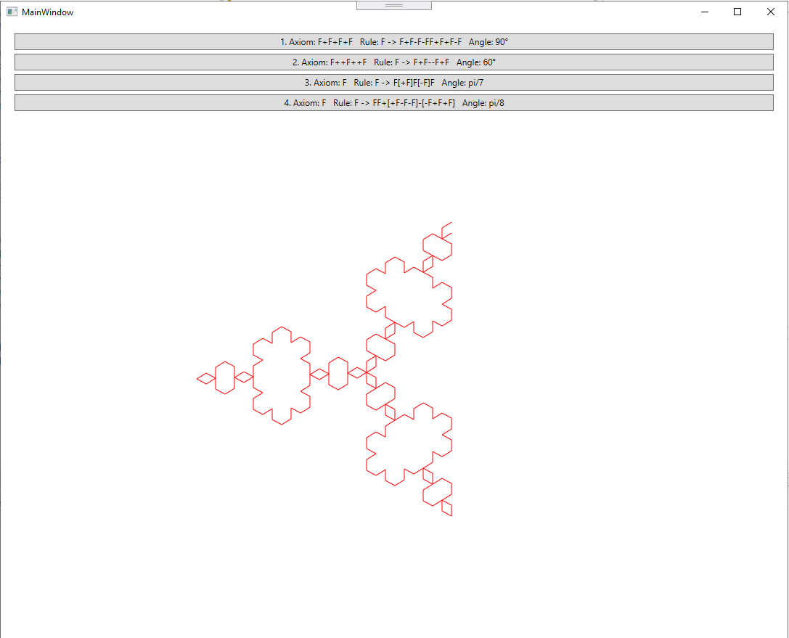
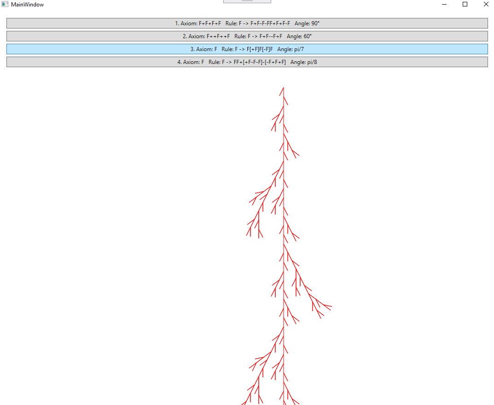
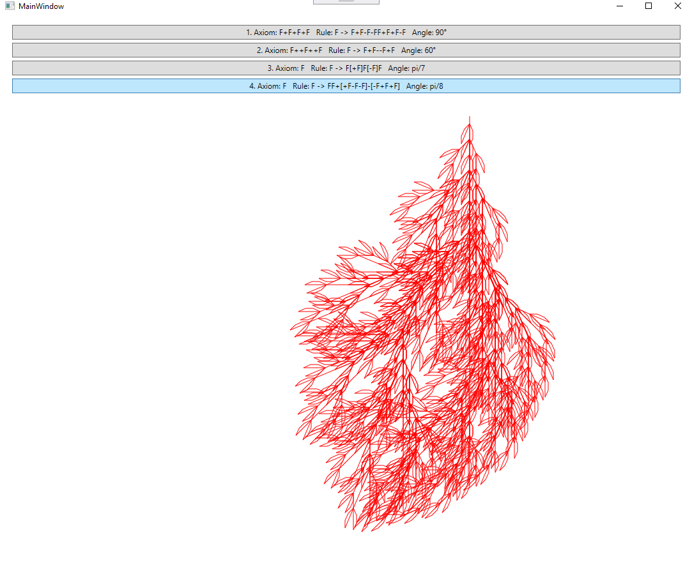

# NAVY
Implement the following L-systems:

1. Axiom: F+F+F+F
   Rule: F -> F+F-F-FF+F+F-F
   Angle: 90°
   
 
   
2. Axiom: F++F++F
   Rule: F -> F+F--F+F
   Angle: 60°
   
   
   
3. Axiom: F
   Rule: F -> F[+F]F[-F]F
   Angle: pi/7
   
 

4. Axiom: F
   Rule: F -> FF+[+F-F-F]-[-F+F+F]
   Angle: pi/8
   
    
